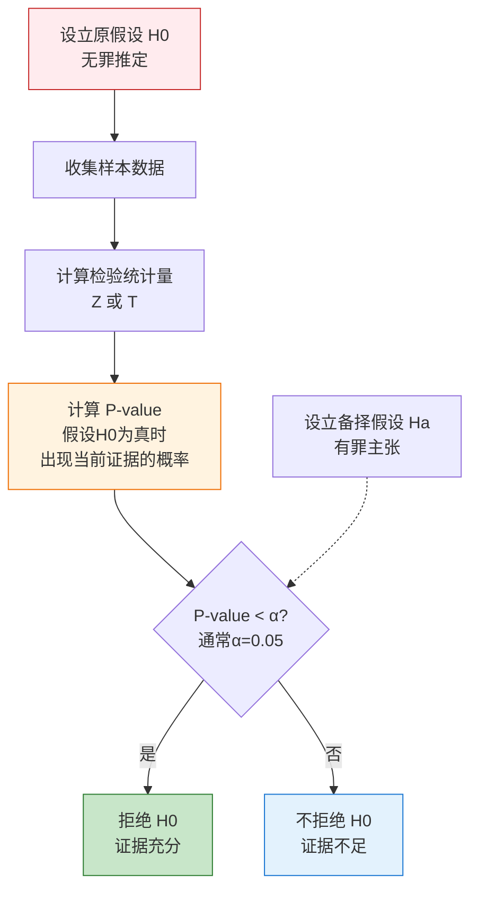
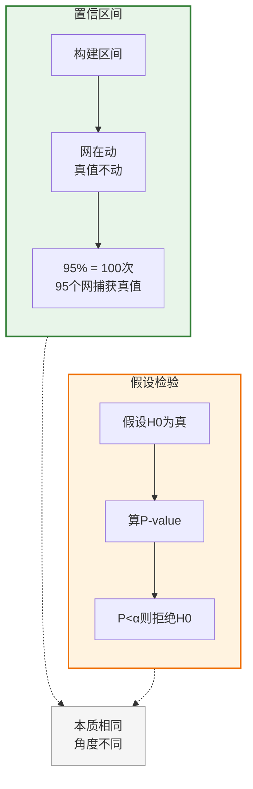
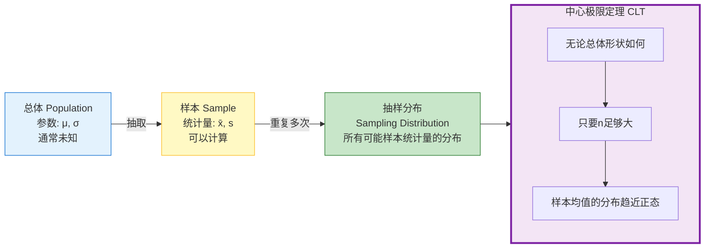

```mermaid
flowchart TD
    H0[设立原假设 H0<br/>无罪推定]
    H1[设立备择假设 Ha<br/>有罪主张]
    Data[收集样本数据]
    Calc[计算检验统计量<br/>Z 或 T]
    Pval[计算 P-value<br/>假设H0为真时<br/>出现当前证据的概率]
    Compare{P-value < α?<br/>通常α=0.05}
    Reject[拒绝 H0<br/>证据充分]
    Fail[不拒绝 H0<br/>证据不足]
    
    H0 --> Data --> Calc --> Pval --> Compare
    H1 -.-> Compare
    Compare -->|是 | Reject
    Compare -->|否 | Fail
    
    style H0 fill:#ffebee,stroke:#c62828
    style Pval fill:#fff3e0,stroke:#ef6c00
    style Reject fill:#c8e6c9,stroke:#2e7d32
    style Fail fill:#e3f2fd,stroke:#1976d2
```

```mermaid
flowchart TD
    subgraph CI[置信区间]
        direction TB
        CI1[构建区间]
        CI2[网在动<br/>真值不动]
        CI3[95% = 100次<br/>95个网捕获真值]
        CI1 --> CI2 --> CI3
    end
    
    subgraph HT[假设检验]
        direction TB
        HT1[假设H0为真]
        HT2[算P-value]
        HT3[P<α则拒绝H0]
        HT1 --> HT2 --> HT3
    end
    
    CI ~~~ HT
    Link[本质相同<br/>角度不同]
    CI -.-> Link
    HT -.-> Link
    
    style CI fill:#e8f5e9,stroke:#2e7d32,stroke-width:2px
    style HT fill:#fff3e0,stroke:#ef6c00,stroke-width:2px
    style Link fill:#f5f5f5,stroke:#9e9e9e
```

```mermaid
graph LR
    Pop[总体 Population<br/>参数: μ, σ<br/>通常未知]
    Sample[样本 Sample<br/>统计量: x̄, s<br/>可以计算]
    Sampling[抽样分布 
    Sampling Distribution<br/>所有可能样本统计量的分布]
    
    Pop -->|抽取 | Sample
    Sample -->|重复多次 | Sampling
    
    subgraph CLT[中心极限定理 CLT]
        CLT1[无论总体形状如何]
        CLT2[只要n足够大]
        CLT3[样本均值的分布趋近正态]
        CLT1 --> CLT2 --> CLT3
    end
    
    Sampling --> CLT
    
    style Pop fill:#e3f2fd,stroke:#1976d2
    style Sample fill:#fff9c4,stroke:#fbc02d
    style Sampling fill:#c8e6c9,stroke:#2e7d32
    style CLT fill:#f3e5f5,stroke:#7b1fa2,stroke-width:3px
```