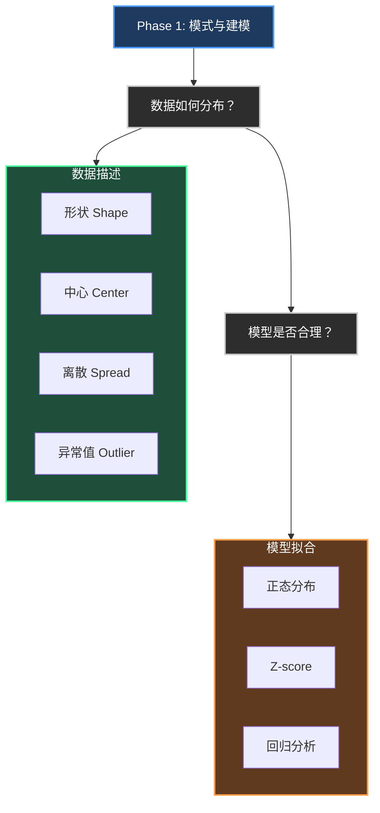

---

## 📚 Phase 1 关键概念速查

| 概念 | 一句话定义 |
|------|------------|
| **IQR** (四分位距) | 第75百分位数 - 第25百分位数，中间50%数据的范围 |
| **Standard Deviation** (标准差) | 数据平均偏离均值多远，衡量离散程度 |
| **Z-score** | 一个数据点距离均值有几个标准差 |
| **右(左)偏** (Right/left Skewed) | 右(左)侧"尾巴"更长 / 离平均值更远 |
| **残差** (Residual) | 实际值 - 预测值，模型预测的误差 |

---

## 🤔 5个直觉问题（点击展开）

问题1：右偏分布中，Mean 和 Median 哪个更大？

**答案：** Mean > Median

**直觉解释：** 右偏时，右边尾巴的极端大值会把 Mean"拉"过去，但 Median 不受影响（它只看中间位置）。所以 Mean 更靠近尾巴方向。

**生活类比：** 一个房间里9个人月薪1万，1个人月薪100万。Median 还是1万左右，但 Mean 会被拉高到10万+。

问题2：什么时候用 IQR 而不是 Standard Deviation？

**答案：** 当数据有异常值或分布不对称时

**直觉解释：** SD 对极端值敏感（因为要平方），IQR 只看中间50%，更鲁棒。

**类比：** SD 像平均身高，IQR 像中位数身高。如果篮球队混进一个姚明，平均身高会被拉高，但中位数几乎不变。

问题3：Z-score = 2 是什么意思？

**答案：** 这个数据点比均值高2个标准差

**直觉解释：** Z-score 是"标准化尺子"，把不同单位的数据变成同一尺度。Z=2说明这个值在正态分布中已经超过约97.5%的数据了。

**类比：** 就像说"你比平均身高高2个'身高单位'"，不管这个单位是cm还是inch。

问题4：r = 0.8 和 r = -0.8，哪个关系更强？

**答案：** 一样强！

**直觉解释：** r 的绝对值衡量强度，正负号只表示方向。0.8和-0.8都是强相关，只是一个正相关一个负相关。

**类比：** 两个人跑步速度一样快，一个向前跑一个向后跑，速度大小相同。

问题5：残差图如果是弯曲的，说明什么？

**答案：** 线性模型不合适，数据可能有曲线关系

**直觉解释：** 残差图应该是随机散点（像雪花）。如果有规律（比如弯曲），说明模型没捕捉到数据的某种模式。

**类比：** 你用直线去拟合一条曲线，肯定有些地方误差系统性地偏大。

