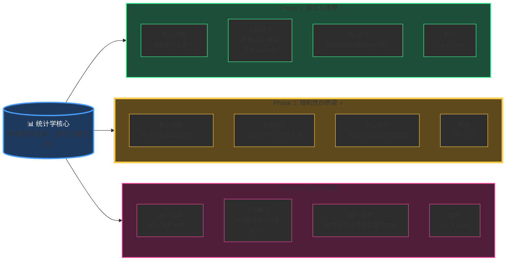
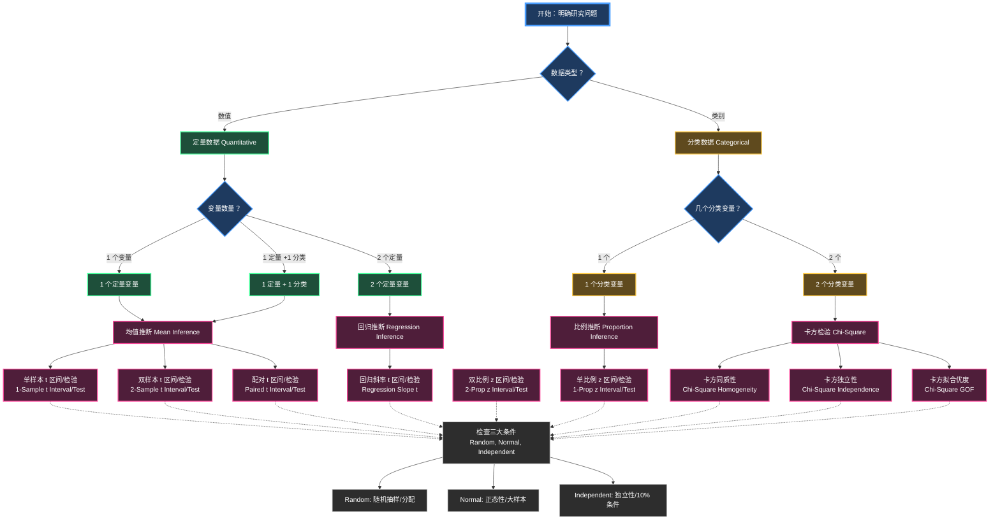

```mermaid
graph LR
    Core[("📊 统计学核心<br/><span style='font-size:16px'>样本推测总体 + 量化不确定性</span>")]
    
    subgraph P1[<span style='font-size:15px'>Phase 1: 模式与建模</span>]
        P1Q[<span style='font-size:14px'>核心问题<br/>数据长什么样？</span>]
        P1C[<span style='font-size:14px'>关键概念<br/>形状/中心/离散<br/>正态/Z-score</span>]
        P1I[<span style='font-size:14px'>核心直觉<br/>模型是给乱数据的一把尺</span>]
        P1Ch[<span style='font-size:14px'>教材<br/>Ch 1,2,3,6</span>]
    end
    
    subgraph P2[<span style='font-size:15px'>Phase 2: 随机性的桥梁 ⭐</span>]
        P2Q[<span style='font-size:14px'>核心问题<br/>样本统计量如何变化？</span>]
        P2C[<span style='font-size:14px'>关键概念<br/>抽样分布/CLT/标准误</span>]
        P2I[<span style='font-size:14px'>核心直觉<br/>大样本让随机性可预测</span>]
        P2Ch[<span style='font-size:14px'>教材<br/>Ch 4,5,7</span>]
    end
    
    subgraph P3[<span style='font-size:15px'>Phase 3: 判决与推断</span>]
        P3Q[<span style='font-size:14px'>核心问题<br/>结论有多可靠？</span>]
        P3C[<span style='font-size:14px'>关键概念<br/>CI/假设检验/P值<br/>Z vs T</span>]
        P3I[<span style='font-size:14px'>核心直觉<br/>用概率语言做有依据的判断</span>]
        P3Ch[<span style='font-size:14px'>教材<br/>Ch 8,9,10</span>]
    end
    
    Core --> P1
    Core --> P2
    Core --> P3
    
    style Core fill:#1e3a5f,stroke:#4a9eff,stroke-width:3px,color:#ffffff
    style P1 fill:#1e4f3a,stroke:#4aff9e,stroke-width:2px,color:#ffffff
    style P2 fill:#5f4a1e,stroke:#ffcc4a,stroke-width:4px,color:#ffffff
    style P3 fill:#4f1e3a,stroke:#ff4a9e,stroke-width:2px,color:#ffffff
    style P1Q fill:#2d2d2d,stroke:#4aff9e,stroke-width:1px,color:#ffffff
    style P1C fill:#2d2d2d,stroke:#4aff9e,stroke-width:1px,color:#ffffff
    style P1I fill:#2d2d2d,stroke:#4aff9e,stroke-width:1px,color:#ffffff
    style P1Ch fill:#2d2d2d,stroke:#4aff9e,stroke-width:1px,color:#ffffff
    style P2Q fill:#2d2d2d,stroke:#ffcc4a,stroke-width:1px,color:#ffffff
    style P2C fill:#2d2d2d,stroke:#ffcc4a,stroke-width:1px,color:#ffffff
    style P2I fill:#2d2d2d,stroke:#ffcc4a,stroke-width:1px,color:#ffffff
    style P2Ch fill:#2d2d2d,stroke:#ffcc4a,stroke-width:1px,color:#ffffff
    style P3Q fill:#2d2d2d,stroke:#ff4a9e,stroke-width:1px,color:#ffffff
    style P3C fill:#2d2d2d,stroke:#ff4a9e,stroke-width:1px,color:#ffffff
    style P3I fill:#2d2d2d,stroke:#ff4a9e,stroke-width:1px,color:#ffffff
    style P3Ch fill:#2d2d2d,stroke:#ff4a9e,stroke-width:1px,color:#ffffff
```

```mermaid
graph TD
    %% 核心样式定义
    classDef core fill:#1e3a5f,stroke:#4a9eff,stroke-width:2px,color:#ffffff;
    classDef quant fill:#1e4f3a,stroke:#4aff9e,stroke-width:2px,color:#ffffff;
    classDef cat fill:#5f4a1e,stroke:#ffcc4a,stroke-width:2px,color:#ffffff;
    classDef infer fill:#4f1e3a,stroke:#ff4a9e,stroke-width:2px,color:#ffffff;
    classDef condition fill:#2d2d2d,stroke:#cccccc,stroke-width:2px,color:#ffffff;
    classDef start fill:#1e3a5f,stroke:#4a9eff,stroke-width:4px,color:#ffffff;

    Start[开始：明确研究问题]:::start
    DataType{数据类型？}:::core
    VarCount{变量数量？}:::core
    
    %% 定量数据分支
    QuantData[定量数据 Quantitative]:::quant
    OneQuant[1 个定量变量]:::quant
    TwoQuantMix[1 定量 + 1 分类]:::quant
    TwoQuant[2 个定量变量]:::quant
    
    %% 分类数据分支
    CatData[分类数据 Categorical]:::cat
    OneCat[1 个分类变量]:::cat
    TwoCat[2 个分类变量]:::cat
    
    %% 推断方法分支
    InferenceMean[均值推断 Mean Inference]:::infer
    InferenceProp[比例推断 Proportion Inference]:::infer
    InferenceChi[卡方检验 Chi-Square]:::infer
    InferenceReg[回归推断 Regression Inference]:::infer
    
    %% 具体方法
    OneSampleT[单样本 t 区间/检验<br/>1-Sample t Interval/Test]:::infer
    TwoSampleT[双样本 t 区间/检验<br/>2-Sample t Interval/Test]:::infer
    PairedT[配对 t 区间/检验<br/>Paired t Interval/Test]:::infer
    OnePropZ[单比例 z 区间/检验<br/>1-Prop z Interval/Test]:::infer
    TwoPropZ[双比例 z 区间/检验<br/>2-Prop z Interval/Test]:::infer
    ChiGOF[卡方拟合优度<br/>Chi-Square GOF]:::infer
    ChiHomog[卡方同质性<br/>Chi-Square Homogeneity]:::infer
    ChiIndep[卡方独立性<br/>Chi-Square Independence]:::infer
    RegT[回归斜率 t 区间/检验<br/>Regression Slope t]:::infer
    
    %% 条件检查
    Conditions[检查三大条件<br/>Random, Normal, Independent]:::condition
    Random[Random: 随机抽样/分配]:::condition
    Normal[Normal: 正态性/大样本]:::condition
    Independent[Independent: 独立性/10% 条件]:::condition
    
    %% 连接关系
    Start --> DataType
    DataType -->|数值 | QuantData
    DataType -->|类别 | CatData
    
    QuantData --> VarCount
    VarCount -->|1 个变量 | OneQuant
    VarCount -->|1 定量 +1 分类 | TwoQuantMix
    VarCount -->|2 个定量 | TwoQuant
    
    CatData --> VarCountCat{几个分类变量？}:::core
    VarCountCat -->|1 个 | OneCat
    VarCountCat -->|2 个 | TwoCat
    
    OneQuant --> InferenceMean
    InferenceMean --> OneSampleT
    
    TwoQuantMix --> InferenceMean
    InferenceMean --> TwoSampleT
    InferenceMean --> PairedT
    
    TwoQuant --> InferenceReg
    InferenceReg --> RegT
    
    OneCat --> InferenceProp
    InferenceProp --> OnePropZ
    
    TwoCat --> InferenceChi
    InferenceChi --> ChiHomog
    InferenceChi --> ChiIndep
    InferenceChi --> ChiGOF
    
    %% 条件连接
    OneSampleT -.-> Conditions
    TwoSampleT -.-> Conditions
    PairedT -.-> Conditions
    OnePropZ -.-> Conditions
    TwoPropZ -.-> Conditions
    ChiGOF -.-> Conditions
    ChiHomog -.-> Conditions
    ChiIndep -.-> Conditions
    RegT -.-> Conditions
    
    Conditions --> Random
    Conditions --> Normal
    Conditions --> Independent
    
    %% 样式应用
    style Start fill:#1e3a5f,stroke:#4a9eff,stroke-width:4px,color:#ffffff
    style DataType fill:#1e3a5f,stroke:#4a9eff,stroke-width:2px,color:#ffffff
    style VarCount fill:#1e3a5f,stroke:#4a9eff,stroke-width:2px,color:#ffffff
    style VarCountCat fill:#1e3a5f,stroke:#4a9eff,stroke-width:2px,color:#ffffff
    style Conditions fill:#2d2d2d,stroke:#cccccc,stroke-width:2px,color:#ffffff
    style Random fill:#2d2d2d,stroke:#cccccc,stroke-width:1px,color:#ffffff
    style Normal fill:#2d2d2d,stroke:#cccccc,stroke-width:1px,color:#ffffff
    style Independent fill:#2d2d2d,stroke:#cccccc,stroke-width:1px,color:#ffffff
```