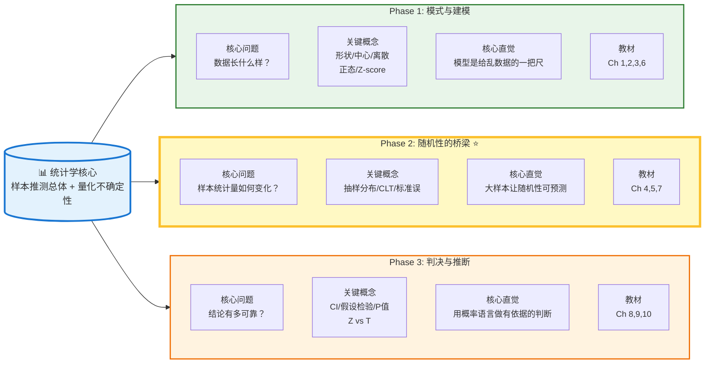

# 📋 AP 统计学符号速查表

## 一、核心区分：总体 vs 样本

| 概念 | 总体参数 (Population) | 样本统计量 (Sample) | 记忆技巧 |
|------|---------------------|-------------------|---------|
| 均值 | μ (mu) | x̄ (x-bar) | 希腊字母=总体，英文字母=样本 |
| 标准差 | σ (sigma) | s | σ 更"圆滑"=上帝视角 |
| 方差 | σ² | s² | 标准差的平方 |
| 比例 | p | p̂ (p-hat) | ^ 表示"估计" |
| 相关系数 | ρ (rho) | r | ρ 是"真正的"相关 |
| 截距 | β₀ (beta-zero) | b₀ 或 a | β=总体，b=样本 |
| 斜率 | β₁ (beta-one) | b₁ 或 b | 回归线用 b |

---

## 二、Phase 1: 描述统计

| 符号 | 英文 | 中文 | 公式/说明 |
|------|------|------|----------|
| n | sample size | 样本量 | 数据的个数 |
| N | population size | 总体大小 | 总体的个数 |
| x̄ | sample mean | 样本均值 | Σxᵢ/n |
| M 或 Med | median | 中位数 | 中间位置的值 |
| Q₁ | first quartile | 第一四分位数 | 25% 位置 |
| Q₃ | third quartile | 第三四分位数 | 75% 位置 |
| IQR | interquartile range | 四分位距 | Q₃ - Q₁ |
| sₓ | sample standard deviation | 样本标准差 | √[Σ(xᵢ-x̄)²/(n-1)] |
| z | z-score | 标准化分数 | (x-μ)/σ 或 (x-x̄)/s |
| r | correlation coefficient | 相关系数 | -1≤r≤1，衡量线性强度 |
| r² | coefficient of determination | 决定系数 | 回归中解释的变异比例 |
| ŷ | predicted y | y 的预测值 | 回归方程计算得出 |
| residual | residual | 残差 | y - ŷ (观测值 - 预测值) |
| s | standard deviation of residuals | 残差标准差 | 典型预测误差大小 |

---

## 三、Phase 2: 概率与抽样分布

| 符号 | 英文 | 中文 | 公式/说明 |
|------|------|------|----------|
| P(A) | probability of A | 事件 A 的概率 | 0≤P(A)≤1 |
| P(A\|B) | conditional probability | 条件概率 | B 发生时 A 的概率 |
| E(X) 或 μₓ | expected value | 期望值 | 随机变量的长期平均 |
| σₓ | standard deviation of X | X 的标准差 | 随机变量的离散程度 |
| p̂ | sample proportion | 样本比例 | 成功次数/n |
| σp̂ | standard deviation of p̂ | p̂ 的标准差 | √[p(1-p)/n] |
| SE | standard error | 标准误 | 统计量的标准差估计 |
| x̄ 的抽样分布 | sampling distribution of x̄ | 样本均值的分布 | 均值=μ, 标准差=σ/√n |
| CLT | Central Limit Theorem | 中心极限定理 | n≥30 时近似正态 |

---

## 四、Phase 3: 推断统计

### 置信区间 (Confidence Interval)

| 符号 | 英文 | 中文 | 说明 |
|------|------|------|------|
| CI | confidence interval | 置信区间 | 估计总体参数的范围 |
| C-level | confidence level | 置信水平 | 如 95%, 99% |
| α | alpha | 显著性水平 | α = 1 - C-level |
| z* | critical value (Z) | Z 临界值 | 如 95% 对应 1.96 |
| t* | critical value (T) | T 临界值 | 查表，依赖 df |
| df | degrees of freedom | 自由度 | 通常 n-1 |
| ME | margin of error | 误差范围 | 临界值 × 标准误 |

### 假设检验 (Hypothesis Test)

| 符号 | 英文 | 中文 | 说明 |
|------|------|------|------|
| H₀ | null hypothesis | 原假设 | "无罪推定"，默认成立 |
| Hₐ 或 H₁ | alternative hypothesis | 备择假设 | 研究者想证明的 |
| p-value | p-value | P 值 | H₀ 为真时出现当前证据的概率 |
| α | significance level | 显著性水平 | 通常 0.05 |
| 决策规则 | Decision Rule | 决策规则 | p<α 则拒绝 H₀ |

### 检验统计量 (Test Statistics)

| 检验类型 | 统计量公式 | 分布 |
|---------|-----------|------|
| 1-Proportion Z | z = (p̂-p₀)/√[p₀(1-p₀)/n] | 标准正态 |
| 1-Sample T | t = (x̄-μ₀)/(s/√n) | t 分布 |
| 2-Proportion Z | z = (p̂₁-p̂₂)/SE | 标准正态 |
| 2-Sample T | t = (x̄₁-x̄₂)/SE | t 分布 |
| Paired T | t = x̄d/(sd/√n) | t 分布 |
| Chi-Square | χ² = Σ(观测 - 期望)²/期望 | χ² 分布 |

---

## 五、易混淆概念对照表 ⚠️

| 容易混淆 | 正确理解 | 考试陷阱 |
|---------|---------|---------|
| **r vs r²** | r=相关强度方向，r²=解释的变异比例 | 不要说"r=0.8 表示 80% 变异被解释" |
| **σ vs s** | σ=总体已知，s=样本估计 | 未知σ用 s 时用 T 分布 |
| **p vs p̂** | p=总体真实比例，p̂=样本估计 | 假设检验用 p₀，置信区间用 p̂ |
| **μ vs x̄** | μ=总体参数(固定)，x̄=样本统计量(变动) | H₀ 中用μ，不用 x̄ |
| **P 值定义** | P(数据\|H₀ 为真) | ❌ 不是 P(H₀ 为真\|数据) |
| **置信区间解释** | 100 次里有 95 个区间捕获真值 | ❌ 不是"真值有 95% 概率在区间内" |
| **假设检验结论** | "拒绝 H₀"或"不拒绝 H₀" | ❌ 不要说"接受 H₀" |

---

## 六、分布选择决策树 🌳

```
要做推断？
    │
    ├─→ 数据类型是比例 (Proportion)? → 永远用 Z 检验
    │
    └─→ 数据类型是均值 (Mean)?
            │
            ├─→ 已知总体σ? → Z 检验 (罕见)
            │
            └─→ 未知σ，用 s 估计? → T 检验 (常见)
```

---

## 七、常用临界值速记

| 置信水平 | z* 临界值 |
|---------|----------|
| 90% | 1.645 |
| 95% | 1.96 |
| 99% | 2.576 |

---

## 八、计算器命令速查 (TI-84)

| 功能 | 命令 | 位置 |
|------|------|------|
| 正态概率 | normalcdf( | 2nd→VARS→DISTR |
| 逆正态 | invNorm( | 2nd→VARS→DISTR |
| T 概率 | tcdf( | 2nd→VARS→DISTR |
| 二项概率 | binompdf/binomcdf | 2nd→VARS→DISTR |
| 几何概率 | geometpdf/geometcdf | 2nd→VARS→DISTR |
| 回归统计 | LinReg(a+bx) | STAT→CALC |
| 单样本 T 检验 | T-Test | STAT→TESTS |
| 双样本 T 检验 | 2-SampTTest | STAT→TESTS |
| 比例 Z 检验 | 1-PropZTest | STAT→TESTS |

---

**💡 使用建议：**
1. 打印出来贴在书桌前
2. 做题时先确认符号含义再套公式
3. FRQ 书写时注意区分总体参数和样本统计量
4. 考前重点看"易混淆概念"部分

需要我针对某个特定模块（如假设检验或回归）做更详细的符号说明吗？