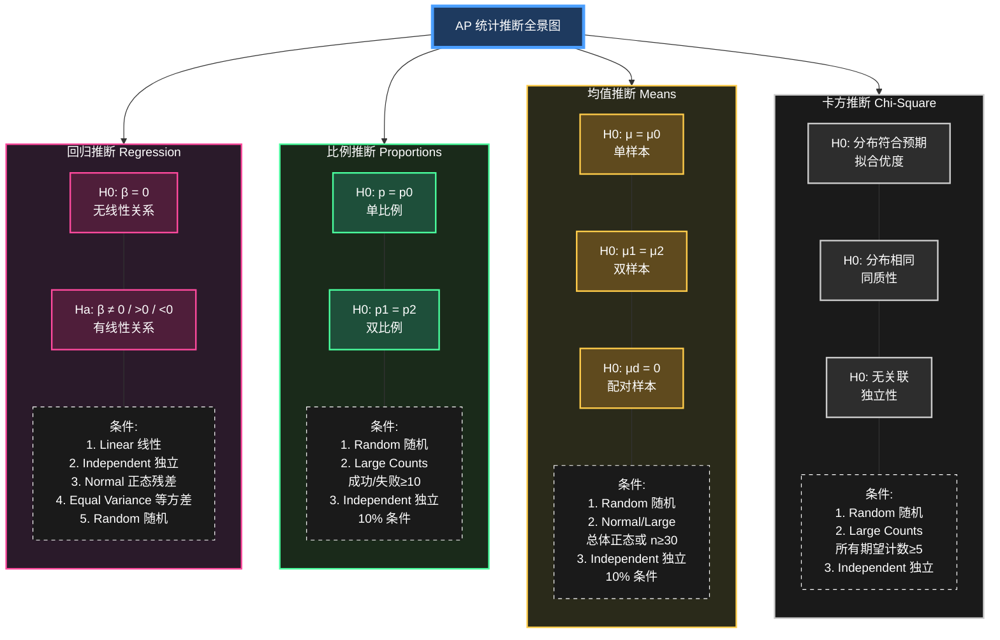

```mermaid
graph TB
    %% 样式定义
    classDef core fill:#1e3a5f,stroke:#4a9eff,stroke-width:3px,color:#ffffff;
    classDef reg fill:#4f1e3a,stroke:#ff4a9e,stroke-width:2px,color:#ffffff;
    classDef prop fill:#1e4f3a,stroke:#4aff9e,stroke-width:2px,color:#ffffff;
    classDef mean fill:#5f4a1e,stroke:#ffcc4a,stroke-width:2px,color:#ffffff;
    classDef chi fill:#2d2d2d,stroke:#cccccc,stroke-width:2px,color:#ffffff;
    classDef condition fill:#1a1a1a,stroke:#ffffff,stroke-width:1px,color:#ffffff,stroke-dasharray: 5 5;

    Start[AP 统计推断全景图]:::core

    %% 回归推断
    subgraph Regression [回归推断 Regression]
        direction TB
        RegH0[H0: β = 0<br/>无线性关系]:::reg
        RegHa[Ha: β ≠ 0 / >0 / <0<br/>有线性关系]:::reg
        RegCond[条件:<br/>1. Linear 线性<br/>2. Independent 独立<br/>3. Normal 正态残差<br/>4. Equal Variance 等方差<br/>5. Random 随机]:::condition
        RegH0 --- RegHa
        RegHa --- RegCond
    end

    %% 比例推断
    subgraph Proportions [比例推断 Proportions]
        direction TB
        Prop1H0[H0: p = p0<br/>单比例]:::prop
        Prop2H0[H0: p1 = p2<br/>双比例]:::prop
        PropCond[条件:<br/>1. Random 随机<br/>2. Large Counts<br/>成功/失败≥10<br/>3. Independent 独立<br/>10% 条件]:::condition
        Prop1H0 --- Prop2H0
        Prop2H0 --- PropCond
    end

    %% 均值推断
    subgraph Means [均值推断 Means]
        direction TB
        Mean1H0[H0: μ = μ0<br/>单样本]:::mean
        Mean2H0[H0: μ1 = μ2<br/>双样本]:::mean
        MeanPH0[H0: μd = 0<br/>配对样本]:::mean
        MeanCond[条件:<br/>1. Random 随机<br/>2. Normal/Large<br/>总体正态或 n≥30<br/>3. Independent 独立<br/>10% 条件]:::condition
        Mean1H0 --- Mean2H0
        Mean2H0 --- MeanPH0
        MeanPH0 --- MeanCond
    end

    %% 卡方推断
    subgraph ChiSquare [卡方推断 Chi-Square]
        direction TB
        ChiGOF[H0: 分布符合预期<br/>拟合优度]:::chi
        ChiHom[H0: 分布相同<br/>同质性]:::chi
        ChiInd[H0: 无关联<br/>独立性]:::chi
        ChiCond[条件:<br/>1. Random 随机<br/>2. Large Counts<br/>所有期望计数≥5<br/>3. Independent 独立]:::condition
        ChiGOF --- ChiHom
        ChiHom --- ChiInd
        ChiInd --- ChiCond
    end

    %% 连接
    Start --> Regression
    Start --> Proportions
    Start --> Means
    Start --> ChiSquare

    %% 应用样式
    style Start fill:#1e3a5f,stroke:#4a9eff,stroke-width:4px,color:#ffffff
    style Regression fill:#2a1a2a,stroke:#ff4a9e,stroke-width:2px,color:#ffffff
    style Proportions fill:#1a2a1a,stroke:#4aff9e,stroke-width:2px,color:#ffffff
    style Means fill:#2a2a1a,stroke:#ffcc4a,stroke-width:2px,color:#ffffff
    style ChiSquare fill:#1a1a1a,stroke:#cccccc,stroke-width:2px,color:#ffffff
```